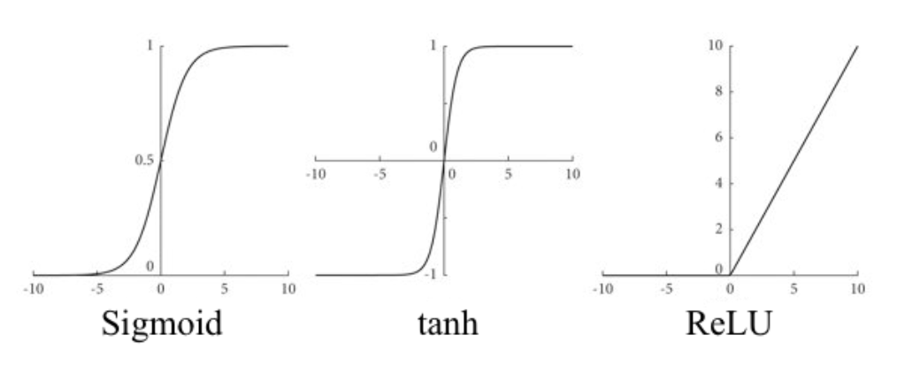
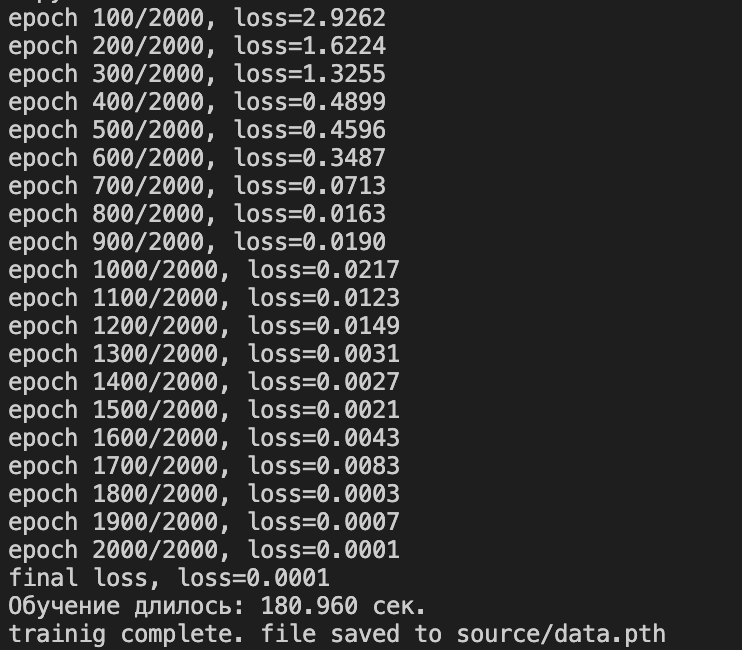

# Intelligent-ChatBot

Content

1. [Briefly about the main thing](#Briefly_about_the_main_thing)
2. [Project structure](#Project_structure)
3. [NLP Preprocessing Pipeline](#NLP_Preprocessing_Pipeline)
    1. [Tokenization by words](#Tokenization_by_words)
    2. [Stemming, lowering the register, exclusion of stop words](#Stemming_lowering_the_register_exclusion_of_stop_words)
    3. [Bag of words](#Bag_of_words)
4. [Neural network](#Neural_network)
5. [Training, saving the result to a file and using the model](#Training_saving_the_result_to_a_file_and_using_the_model)
6. [Launching the bot](#Launching_the_bot)

## <a name="Briefly_about_the_main_thing">Briefly about the main thing</a>

1. Run the file `NLTK_utils.py` after uncommenting `nltk.download('punkt')`. After running the file, this line needs to be commented out back.
```console
python3 NLTK_utils.py
```
2. Next, you need to train the model, for this you need to run the file `train.py`. The result of the launch will be the generation of the file `data.pth`.
```console
python3 train.py
```
3. You need to get a Telegram API-Token. (See how to do this on the Internet).
4. Now you need to create the `settings.py` file in the `code` folder and enter your Telegram API-Token there according to the following template: 
```python
TOKEN = 'Your-Telegram-API-Token'
```
5. Everything is ready to launch the telegram bot. Run the file `IntelligentChatBotTelegram.py`.
```console
python3 IntelligentChatBotTelegram.py
```

<details>
    <summary>Saving the learning result</summary>
    If you do not want to run training, then you can use the result of my training «copy_data.pth» from the «saving_the_learning_result» folder. You will need to move this file to the «source» folder and rename it to «data.pth».
</details>

<details>
    <summary>Customize</summary>
    If you want to use the bot for personal purposes, then you can change the dataset file. Enter your "tag", "patterns" and "responses" in the «intents.json» file or delete the ones you don't need. After making changes to the dataset, the model needs to be retrained.
</details>

Below you will find more detailed information about the project. If this is not enough for you, then you can look at the report (file [Coursework Report.pdf](Coursework%20Report.pdf)) there is a theory and what will be written below. The report is in Russian.

## <a name="Project_structure">Project structure</a>

It is very inefficient to implement all the functions in one file, so the whole project is implemented in several files with the following names: `IntelligentChatBotTelegram.py`, `settings.py`, `NLTK_utils.py`, `model.py`, `train.py`, `console_chat_with_Jarvis.py`. Each of these files has a certain relationship with each other, but to show it, you also need to designate the `source` folder. It contains the files `intents.json`, `data.pth` and `pictures`, which are used for the Telegram messenger. The project structure is shown in the figure below.


An overview of the contents of the files should start with `NLTK_utils.py` and `model.py`. The first file implements the functions of tokenization (**tokenize**), stemming with lowering the register (**stem**) and bag of words (**bag_of_words**). The second file implements a **feed forward neural network model with two hidden layers**. The diagram of the neural network is shown in the figure below.


File `intents.json` - contains a dataset. The structure of the dataset is shown in the listing below. The dataset consists of many blocks, each block has a `tag`, `patterns` and `responses`. The generalization of the block is stored in `tag`, `patterns` stores what the user can write, and `responses` stores possible answers when using this block. The larger the `tag`, the more topics the bot will understand. The more `patterns` there are, the more accurately the model will determine the theme. The more `responses` there are, the more varied the bot's responses will be.

```json
{
    "intents": [
        {
            "tag": "",
            "patterns": [
                "",
                "",
                "",
                "",
                ""
            ],
            "responses": [
                "",
                "",
                "",
                "",
                ""
            ]
        }
    ]
}
```

The file `train.py` - as the name implies, implements the training of the model. This file implements reading data from the dataset, `preparing` data for training, creating a model with given hyperparameters, training the model, and writing the training result to the `data.pth` file for further use. Training on a large amount of data takes a lot of time, so it is beneficial to save the training result for further use in other files. When changing the file `intents.json` or some other manipulations with the model, it needs to be trained again, i.e. run `train.py` file

After training the model, you can use the files `console_chat_with_Jarvis.py` and `IntelligentChatBotTelegram.py`.

An intelligent chat bot is implemented in the `console_chat_with_Jarvis.py` file. A trained model is created here (thanks to the `data.pth` file). Also, messages from the user are received here, and in accordance with the received messages, responses are issued, which are stored in the `intents.json` dataset.

The file `IntelligentChatBotTelegram.py` contains the implementation of the Telegram bot. Messages received in the Telegram messenger will be sent to an intelligent bot (`console_chat_with_Jarvis.py`), processed there and the processing result will be returned back to the messenger and delivered to the user. Also, the file `IntelligentChatBotTelegram.py` is associated with `settings.py`, which stores the **Telegram API-Token** of the Telegram bot. There is nothing else in this file except for the key. This is done for security purposes. For example, when placing code in a public GitHub repository without keeping the API-Token secure, we actually cease to be the sole owner of the bot.

## <a name="NLP_Preprocessing_Pipeline">NLP Preprocessing Pipeline</a>

Preparing data for work is a very important process. All the necessary actions that need to be performed with the received string are shown in the figure below. To implement this **Preprocessing Pipeline**, you will need the NLTK library, which already implements these functions.


### <a name="Tokenization_by_words">Tokenization by words</a>

Processing starts with tokenization. An important fact is that for the tokenization function to work from the NLTK library, the `punkt` module must be downloaded. To do this, at the first start, you must execute the line of code `nltk.download ('punkt')`, on subsequent starts, this line must be commented out, because the necessary package is downloaded and it does not make sense to download it every time. The function in which tokenization is implemented can be found in the `NLTK_utils.py` file.

An example of the operation of the tokenization algorithm is shown in the figure below.


### <a name="Stemming_lowering_the_register_exclusion_of_stop_words">Stemming, lowering the register, exclusion of stop words</a>

The next stage of preparation includes several actions at once. The stemming function is implemented using the same NLTK library, which contains many different versions of the stemming algorithm. The project will use the `Porter Stemmer`, which was implemented by Martin Porter in 1980, but with modern improvements from the NLTK team. In the stemming function, the lowering the register function will be applied immediately. The implementation of the stemming function with lowering the register can be found in the `NLTK_utils.py` file.

The **stop words** that are defined in the `stop_words` array will be excluded during training when creating the `all_words` vector.

The `all_words` vector is obtained as follows: tokenization is applied to all "patterns" from the dataset. You will get a list of all words, but not yet processed to the end. Stemming with lowering the register and exclusion of stop words is applied to this list. It is also worth noting that repeated words are not included in the vector of all words. The implementation of getting the vector of `all_words` is shown in the listing below.

```python
all_words = [stem(w) for w in all_words if w not in stop_words]
all_words = sorted(set(all_words))
```

The first line calls the stemming function with lowering the register if the word is not a stop word. And in the second line, the resulting new array of all words is sorted and repeated words are cut off.

In the figure below, the first example shows the work of stemming with lowering the register and the removal of stop words. The second example in this figure demonstrates that for three words that are written differently, but close in meaning, the same word is obtained after stemming, so only unique stemming results are used for the vector of all words. The third example shows how words similar in spelling, but denoting completely different things, have the same word as a result of stemming. This is the main feature of stemming: it is much easier to implement and its speed is higher than that of *lemming*, but you have to pay for this with low “accuracy”, which, perhaps, will not matter much in some cases.


### <a name="Bag_of_words">Bag of words</a>

Once the vector of all words has been created, it becomes possible to use the bag of words function. The implementation of the bag of words function can be found in the file `NLTK_utils.py`.

This function takes two parameters as input: a tokenized sentence and a vector of all words. The stemming function is applied to the tokenized sentence with lowering the register if necessary. It is not necessary to remove repeated or stop words from this sentence. Based on the vector of all words, a `bag` vector of the same dimension is created, which is filled with zeros. Further, in the loop, it is checked whether there is a word from the sentence in the vector of all words, if yes, then in the created `bag` vector, the corresponding cell is replaced by 1. That is why the same and stop words are not removed from the processed sentence vector (if a word occurs several times, it will not affect anything, since the `bag` vector is already worth 1, and there are not even cells with 0 for stop words, so the presence or absence of stop words will not affect anything). As a result of this function, the so-called `one-hot` vector will be obtained, which is used in the neural network model as input.

## <a name="Neural_network">Neural network</a>

The project implemented a feed forward neural network with two hidden layers. The implementation of the model is in the `model.py` file, and its schematic view can be seen in the figure above.

The number of input neurons is equal to the number of elements of the vector of `all_words`. How the vector `all_words` is obtained was considered earlier. The number of output neurons is equal to the number of `tag` from the dataset. How many hidden layers to take, as well as the number of neurons in these layers, no one knows, but the deeper the neural network, the more complex dependencies it is able to determine. In the work, two hidden layers were selected to determine which class the sent message belongs to. The number of neurons in these layers is equal to half of the input neurons. These hyperparameters are configured when the model is created, in the `train.py` file, where the model will be trained. In addition to these hyperparameters, there are others: `num_epochs`, `batch_size` and `learning_rate`. During multiple tests, the optimal values of the model hyperparameters were determined, which are shown in the listing below.

```python
# Hyper-parameters 
num_epochs = 2000                     # Number of training for all data sets
batch_size = 30                       # Input data size for one iteration
learning_rate = 0.00001               # Learning rate
input_size = len(X_train[0])          # Number of neurons on the input layer # input_size = len(all_words) - it's clearer this way
hidden_size = int(len(X_train[0])/2)  # Number of neurons in the hidden layer
output_size = len(tags)               # Number of neurons in the output layer
```

## <a name="Training_saving_the_result_to_a_file_and_using_the_model">Training, saving the result to a file and using the model</a>

Model training is implemented in the `train.py` file and takes place in two stages: forward and backward. In the forward run, the test data is run through the neural network and an answer is obtained, which is compared with a previously known answer. Then comes the backward run (in another way, it is also called the backpropagation method), in which the error of this comparison is used to change the weights of neurons in such a way that the error gradually decreases. The amount by which the weights change is determined by the `learning_rate` parameter.

In each neuron, after counting the weights (weights are calculated in a forward run), an activation function is applied. An activation function is a non-linear function that makes non-linear changes to the output (calculation result) of the layer. It ensures that the network is able to compute all sorts of complex functions, including very highly non-linear ones. The most common functions are `sigmoid`, `hyperbolic tangent` and `ReLU`, the graphs of which are shown in the figure below. The project uses the `ReLU` function.



The learning objective is based on minimizing the loss function The loss function is a measure of how well the predictive model predicts the expected outcome (or value). The loss function is minimized by updating the parameters of the neural network - these are usually the weights of the connections. This is done by the optimizer, which is a method of achieving better results by making minor changes to parameters such as weights and learning rate to make the model perform better.

`CrossEntropyLoss` from the `PyTorch` library is used as the `loss function`. And as an optimizer, an adaptive moment estimation (`Adam`) from the same library is used.

The training result and the hyperparameters of the model are saved to the `data.pth` file, in order not to conduct training every time the bot is launched and not to think about what hyperparameters it was created with when using the model in other places.

The result of running the model training with the hyperparameters discussed earlier is shown in the figure below. The value of the loss function gradually decreases to 0 with each epoch, which is logical and correct. How well the model has trained can be checked after the launch of the bot to which messages will be sent.



When using the model on real data, there is one feature, the activation function is not applied to the output layer, instead the `softmax` function is used, which allows you to interpret the result as the probability of obtaining a class. The softmax function divides the result by the sum of all outputs, so the sum of all output signals will be equal to 1. Softmax ensures that the value of the sum of the probabilities associated with each class will always be 1. The figure below demonstrates the complete operation of the neural network.


## <a name="Launching_the_bot">Launching the bot</a>

After training, it becomes possible to launch the bot, in fact, for which everything was started. There are two launch options: offline launch and launch in Telegram messenger. By running the `console_chat_with_Jarvis.py` file, the chatbot will work in the console, i.e. offline, and if you run `IntelligentChatBotTelegram.py`, then the chat bot will work in Telegram.

A reasonable response from the bot (response from the dataset) will only be received if it is more than `75%` sure that the received message belongs to a certain `tag`. If he is not sure about this, then the answer will be: `I do not understand ...`.

To check how the chatbot works, whether it is well trained, you need to write something to it. The test result is shown in the figure below. It can be seen from the figure that the chatbot understands the topic of the received message well and responds accordingly.

